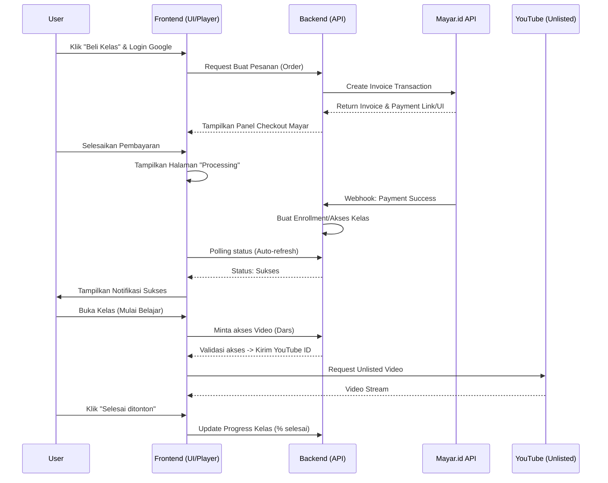
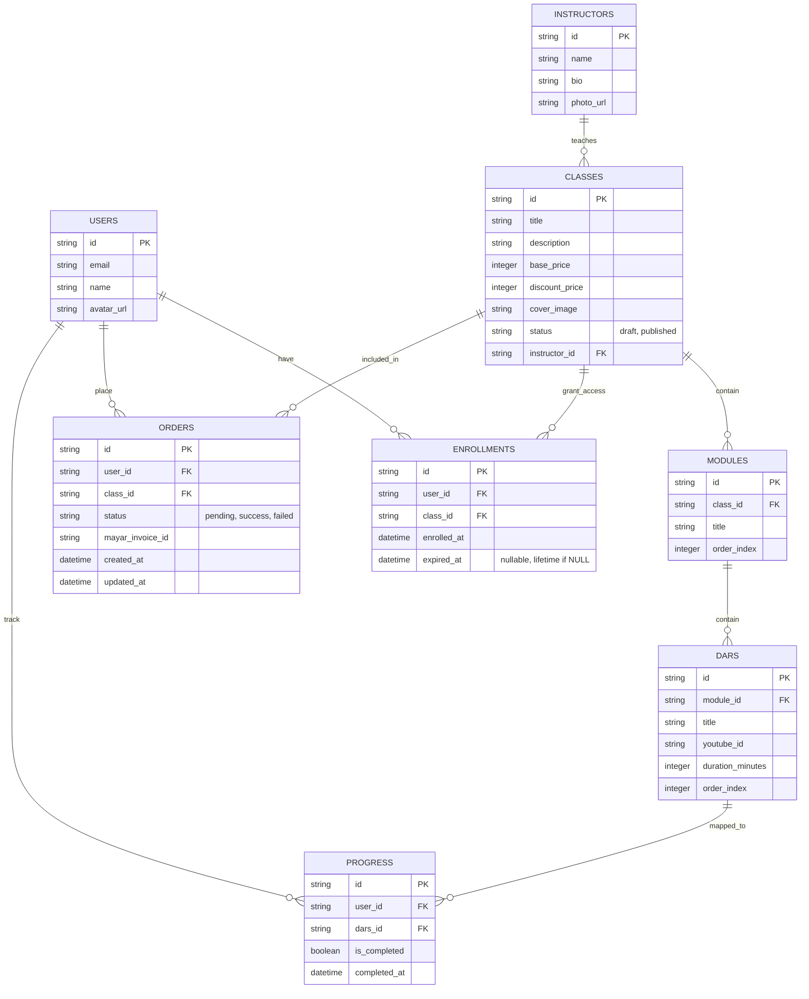

# PRD — Project Requirements Document

## 1. Overview
Markaz Fiqh adalah aplikasi kelas online terstruktur untuk lembaga fiqih (model serupa Udemy) yang dirancang khusus untuk santri, mahasiswa Timur Tengah (masisir), dan masyarakat umum. Saat ini, banyak pelajar yang kesulitan belajar fiqih karena kajian tersebar sporadis dalam banyak video YouTube tanpa urutan yang jelas dan tanpa indikator penyelesaian (progress tracker). 

Aplikasi ini hadir untuk memusatkan dan merapikan kurikulum fiqih menjadi struktur berjenjang (Kelas > Modul > Dars/Pelajaran). Video bersumber dari penelusuran YouTube unlisted yang diintegrasikan secara dinamis oleh sistem. Dengan model pembelian putus (one-time purchase), pelajar dapat dengan mudah memiliki akses seumur hidup terhadap suatu kelas, memonitor progres belajar secara akurat, sekaligus memastikan keamanan distribusi konten video kajian.

## 2. Requirements
- **Struktur Konten:** Materi wajib dibagi menjadi 3 hierarki: Kelas, Modul, dan Dars (Video).
- **Keamanan Video:** ID Video YouTube (yang diset unlisted) harus disimpan di database dan baru diberikan ke pemutar video (frontend) jika pengguna sudah membeli kelasnya (tidak di-hardcode).
- **Otentikasi:** Wajib menggunakan Google Auth. Tidak ada registrasi manual, form password, atau checkout sebagai tamu (guest checkout). Pengguna dapat melihat penawaran tanpa login, tapi diwajibkan login sebelum masuk ke konfirmasi pembelian (keranjang).
- **Sistem Harga:** Mendukung dua jenis harga per kelas: Harga Asli dan Harga Diskon (ditampilkan dicoret/strikethrough jika promo sedang aktif).
- **Pembayaran Terintegrasi (Mayar.id):** Pembayaran ditangani menggunakan API dari Mayar. Checkout dilakukan di dalam antarmuka web itu sendiri (bukan redirect ke halaman eksternal Mayar).
- **Otomatisasi Akses:** Setelah transaksi dibuat, sistem akan menunggu Webhook dari Mayar. Begitu webhook status "sukses" diterima, sistem otomatis membuka akses kelas.
- **Penanganan Masalah Pembayaran (Fallback):** Harus ada halaman status "Pembayaran sedang diproses" yang akan otomatis memuat ulang (auto-refresh). Terdapat fitur admin untuk mengecek status ulang (re-sync) secara manual jika webhook Mayar gagal atau terlambat.

## 3. Core Features
Berbagai fitur dasar di bawah ini difokuskan untuk Fase 1 (Sesuai dengan Roadmap aplikasi):

### Fase 1
- **Katalog & Detail Kelas** — Menjelajah, mencari, dan melihat detail lengkap kelas fiqih sebelum memutuskan membeli.
  - **Daftar Kelas Tersedia:** Menampilkan seluruh kelas dalam grid/daftar beserta rincian indikator harga dan diskon.
  - **Halaman Detail Kelas:** Informasi lengkap deskripsi kelas, daftar isi kurikulum (modul), harga asli, dan harga coret (diskon).
  - **Pencarian Kelas:** Fitur mencari kelas spesifik berdasarkan topik/judul fiqih.
- **Pemutar Video Kelas** — Menonton video kajian (Dars) dari YouTube secara terstruktur dengan navigasi antar pelajaran.
  - **Player Video:** Menjalankan video Dars dari YouTube. ID Video ditarik dinamis dari server untuk mencegah pembajakan tautan yang mudah disebar.
  - **Sidebar Navigasi Modul & Dars:** Daftar isi di sisi layar untuk berpindah antara Modul dan Dars secara interaktif.
  - **Tombol Tandai Selesai:** Tombol yang jika ditekan akan memperbarui dan mencatat persentase pergerakan (progress) kelas.
- **Dashboard Kelas Saya** — Melihat perpustakaan kelas milik pribadi pelanggan.
  - **Daftar Kelas Dimiliki:** Memasukkan dan menampilkan semua kelas yang sudah dibeli dengan sukses.
  - **Pelacak Progress Kelas:** Bar indikator (persentase) yang bergeser sejurus seiring semakin banyaknya Dars yang ditandai selesai.
  - **Lanjutkan Belajar:** Jalan pintas satu klik menuju video (Dars) terakhir yang dipelajari dan belum dituntaskan.
- **Pembelian & Pembayaran** — Membeli kelas satu kali putus melalui gerbang pembayaran digital ringkas dan aman.
  - **Keranjang Belanja:** Tampilan ringkasan/konfirmasi singkat pasca klik beli sebelum finalisasi pembayaran. Menampilkan kelas dan harga akhir.
  - **Checkout & Pembayaran:** Proses bayar melalui framework Mayar API yang disematkan (embedded) pada panel website.
  - **Status Pembayaran:** Halaman auto-refresh jika webhook dari Mayar masih dalam perjalanan atau memproses.
- **Masuk & Verifikasi** — Jaminan keamanan autentikasi pengguna secara instan.
  - **Masuk dengan Google:** Cara otentikasi klik-tunggal, satu-satunya metode login-pendaftaran ke dalam sistem pusat belajar.
  - **Perlindungan Rute:** Jika pengguna berusaha masuk sesi checkout/kelas yang dibeli tanpa diotentikasi, akan diarahkan dulu ke Google Login.
- **Panel Admin Sederhana** [medium] — Back-office kecil untuk kurator kelas dan pengecekan pesanan bermasalah.
  - **Sinkronisasi Ulang Pembayaran:** Tombol penyelesai masalah (troubleshooter) jika webhook pesanan dari server Mayar hilang/tertunda. Admin dapat memencet tombol agar server memeriksa lagi ke pihak Mayar secara manual.
  - **Manajemen Kelas & Modul:** Pembuatan rancang bangun kerangka Kelas. Mengatur struktur modul, penamaan dars, dan penempatan link internal ID YouTube.
  - **Pengaturan Status Publikasi Kelas:** Admin dapat mengubah status kelas antara **Draft** (tidak muncul di katalog publik) dan **Published** (tampil di katalog). Fitur ini memungkinkan admin menyiapkan kelas secara lengkap sebelum dirilis ke publik.
  - **Pencabutan Akses (Revoke Access):** Admin dapat mencabut akses pengguna dari suatu kelas secara manual. Fitur ini berguna untuk menangani refund, pelanggaran kebijakan, atau kesalahan pemberian akses. Saat akses dicabut, record ENROLLMENTS yang bersangkutan akan dihapus atau ditandai tidak aktif, sehingga pengguna tidak lagi dapat mengakses video kelas.

## 4. User Flow
1. **Eksplorasi (Tanpa Login):** Pengguna masuk ke halaman utama Markaz Fiqh $\rightarrow$ Melihat daftar kelas $\rightarrow$ Mengklik satu kelas $\rightarrow$ Melihat rincian silabus serta harga (normal/diskon).
2. **Proses Beli & Otentikasi:** Pengguna klik tombol "Beli Kelas" $\rightarrow$ Karena belum login, aplikasi meminta "Masuk dengan Google" $\rightarrow$ Setelah terautentikasi, pengguna diarahkan ke halaman Ringkasan (Keranjang).
3. **Pembayaran:** Di Keranjang, klik "Bayar Sekarang" $\rightarrow$ Muncul panel Mayar di dalam web $\rightarrow$ Pengguna memilih metode pembayaran (QRIS, E-Wallet, Virtual Account, atau Kartu Kredit) melalui portal pembayaran Mayar $\rightarrow$ Dialihkan ke halaman "Status: Sedang Diproses" (auto-refresh menunggu webhook sukses).
4. **Pembelajaran:** Transaksi berhasil (Webhook diterima) $\rightarrow$ Halaman Status otomatis memperbarui menjadi "Sukses" dan pengguna langsung diarahkan (redirect) ke halaman Dashboard 'Kelas Saya'. Dari sana, pengguna dapat mengklik kelas $\rightarrow$ Memutar video Dars $\rightarrow$ Klik "Tandai Selesai" jika layar video habis $\rightarrow$ Persentase belajar otomatis naik.

## 5. Architecture
Sistem menggunakan arsitektur web modern *client-server*. Frontend menangani UI/UX (Katalog, Player, Keranjang), sedangkan Backend menangani validasi keranjang, komunikasi dengan Mayar API, sinkronisasi keamanan URL YouTube dinamis, serta pengelolaan database progress user. 

**Catatan Tambahan (Kebijakan Masa Depan):** Sistem telah didesain dengan arsitektur yang memungkinkan penerapan **Single Active Session** di masa depan. Kebijakan ini dapat diaktifkan nanti untuk membatasi satu sesi login aktif per akun pada satu waktu, sehingga membantu mencegah penyalahgunaan berbagi akun (account sharing). Implementasinya dapat melibatkan pengelolaan token sesi atau mekanisme refresh token yang divalidasi setiap permintaan API, dan saat ini tidak termasuk dalam cakupan Fase 1.

## 6. Database Schema
Penyimpanan data relasional mencakup manajemen pengguna, kurikulum berjenjang, riwayat pesanan (orders), serta jejak pembelajaran pengguna (progress).

**Penjelasan Tabel Tambahan:**
- **USERS:** Menyimpan identitas log masuk via Google (nama, email, avatar).
- **INSTRUCTORS:** Menyimpan data profil pengajar. Setiap pengajar dapat memiliki banyak kelas yang diajarkan (`instructor_id` di tabel `CLASSES`). Satu kelas hanya memiliki satu pengajar (relasi many-to-one).
- **CLASSES:** Menyimpan data induk kelas, info `base_price` (harga asli), `discount_price` (harga promo - jika isi `0` atau *null* berati tidak ada promo coret), `status` (draft/published) untuk mengontrol visibilitas di katalog publik, dan `instructor_id` sebagai referensi ke pengajar.
- **MODULES:** Bagian dari kurikulum untuk menyatukan Dars per babak (contoh: Modul "Tashrif Izzi"). Terikat dengan `class_id`. Memakai `order_index` untuk urutan tampil.
- **DARS:** Tabel krusial pelajaran (Video). Memuat `youtube_id` (hanya bisa diakses di backend saat user dengan hak enroll meminta datanya).
- **ORDERS:** Mencatat transaksi per-upaya order (cart). `mayar_invoice_id` menaruh relasi pesanan di gerbang pembayaran Mayar. `status` berganti berkat webhook atau tombol re-sync manual admin. Dilengkapi constraint `UNIQUE(user_id, class_id)` untuk status `pending` guna memastikan hanya ada satu pesanan aktif yang belum dibayar per kelas per pengguna. Kolom `updated_at` mencatat waktu terakhir pesanan diubah/diakses kembali.
  - **Business Logic Re-use Invoice:** Untuk mencegah invoice ganda, sistem akan melakukan Re-use Invoice. Jika user memesan kelas yang sama saat status pesanan sebelumnya masih `pending`, sistem tidak akan membuat record baru melainkan memperbarui `updated_at` pada record yang sudah ada dan mengarahkan user kembali ke `payment_url` yang sama.
  - **Business Logic Block Duplicate Purchase:** User tidak bisa membuat pesanan (ORDER) baru — baik `pending` maupun `success` — jika sudah memiliki ENROLLMENT aktif untuk kelas tersebut. Proses pembuatan order harus mengecek tabel `ENROLLMENTS` terlebih dahulu dan menolak dengan pesan yang sesuai jika akses sudah dimiliki.
- **ENROLLMENTS:** Kumpulan 'tiket masuk' yang dibuat server jika log pesanan sukses dibayarkan, memperbolehkan user membuka tabel `DARS`. Memiliki kolom `expired_at` yang dapat diisi tanggal kedaluwarsa akses. **Jika `NULL` maka akses bersifat seumur hidup (lifetime).** Untuk pencabutan akses manual oleh admin, record pada tabel ini akan dihapus atau ditandai khusus.
- **PROGRESS:** Mencatat relasi khusus bahwa *User A* telah menekan tombol Selesai di *Dars X*. Persentase kelas saya didapat dari menjumlah semua Dars di sebuah kelas yang dimiliki dibanding jumlah baris Progress-nya.

## 7. Tech Stack
Menggunakan formasi teknologi modern bertaraf Full-stack standard, memberikan keseimbangan pada kecepatan pengembangan, keandalan database PostgreSQL yang dikelola oleh Supabase, dan kemudahan mengatur otentikasi tunggal.
- **Frontend & App Framework:** Next.js (App Router, Server Components)
- **Styling & UI Library:** Tailwind CSS + shadcn/ui
- **Auth (Google SSO):** Supabase Auth (Google Login)
- **Database:** Supabase (PostgreSQL)
- **ORM/Client:** Drizzle ORM + Supabase Client
- **Storage:** Supabase Storage (untuk aset gambar/thumbnail)
- **Payment Gateway:** Midtrans / Xendit (integrasi pembayaran lokal)